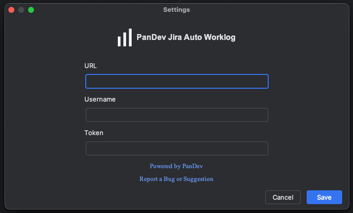
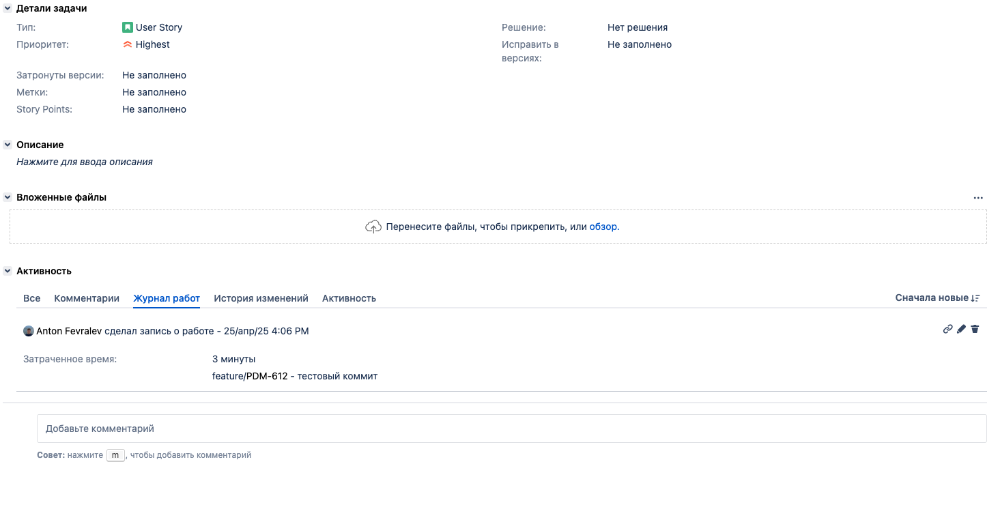

# PanDev Jira Auto Worklog

A plugin for JetBrains products that automatically tracks your work time and publishes worklogs to Jira when you commit code.

## Features

- **Automatic time tracking**: Tracks time spent on coding activities
- **Jira integration**: Publishes worklogs directly to Jira when committing code

## Installation

1. Open IntelliJ IDEA
2. Go to `File → Settings → Plugins`
3. Search for "PanDev Jira Auto Worklog" in the Marketplace
4. Click "Install"
5. Restart IDE when prompted

## Configuration

1. After installation, go to `File → Settings → Tools → PanDevJiraAutoWorklog Settings`
2. Enter your Jira credentials:
    - Jira URL
    - Username (your Jira email)
    - Password (or API token)
    - Enable Basic Auth if required
3. Click "Save" to apply settings

## Usage

### Committing with Worklog

1. Make your code changes as usual
2. Commit changes
3. The plugin will:
    - Record your time spent
    - Create a worklog in Jira

### Viewing Activity

1. Open the Issue in Jira
2. View your work history, including:
    - Time spent
    - Commit messages
    - Jira worklogs

## Troubleshooting

If you encounter issues:
- Verify your Jira credentials are correct
- Check your internet connection
- Ensure you have permissions to create worklogs in Jira
- Use the "Report a Bug or Suggestion" option in settings

## Support

For help or to report issues:
- Email: support@pandev.com
- GitHub: [github.com/pandev-lab/JetBrains-Jira-Auto-Work-Logs](https://github.com/pandev-lab/JetBrains-Jira-Auto-Work-Logs)

---

**Note**: This plugin requires an active Jira account and internet connection to publish worklogs. This is an independent tool and is not officially affiliated with Atlassian